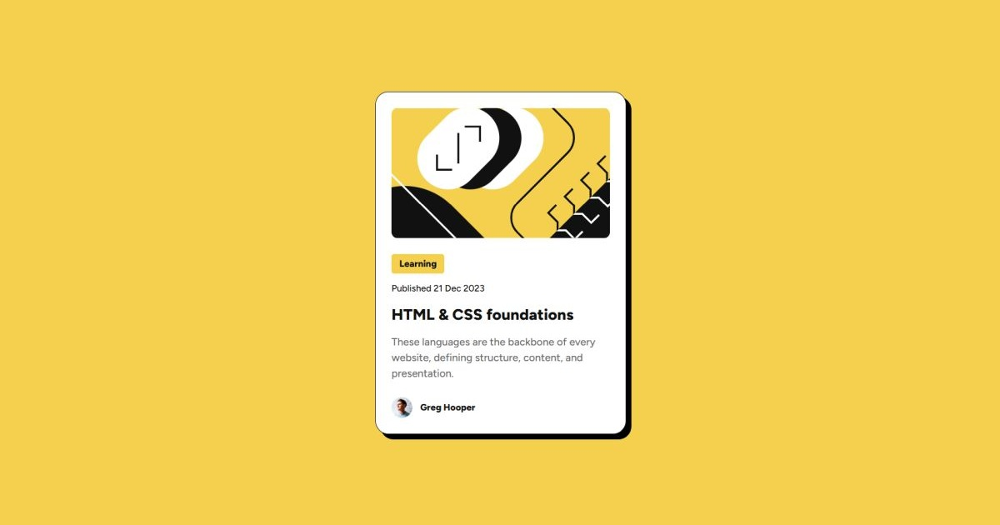

# 💻 Blog Preview Card

## ℹ️ A Simple Blog Preview Card for Learning HTML and CSS

This blog preview card was built using HTML and CSS only, based on a Figma design file and style guide provided.

Created as part of the building challenges from [Frontend Mentor](https://www.frontendmentor.io/).

---

## 🔍 Overview

This project features a clean and responsive card layout that highlights a blog post. It includes a preview image, category tag, publish date, blog title, short description, and author profile.

The design is fully responsive, mobile-first, and uses semantic HTML elements and CSS best practices to replicate a professional blog card layout.

---

## ✨ Features

- Mobile-first responsive layout
- Semantic HTML structure for accessibility
- Custom properties (CSS variables) for theme management
- Hover and focus states for interactive elements
- Minimalist card UI built from scratch
- Preview image and profile avatar handling
- Border + box-shadow combination for depth effect

---

## 🧠 What I Learned

- How to implement a responsive card component using semantic HTML
- Managing layout with Flexbox for vertical and horizontal alignment
- Applying Figma design guidelines into actual code
- Writing scalable CSS using variables and utility classes
- Enhancing readability and structure with BEM-style naming conventions

---

## 🛠️ Tech Used

- HTML5
- CSS3
- Git
- GitHub
- Netlify

---

## 🚀 How to Run

1. Clone the repository
2. Open `index.html` in your browser

---

## 🌐 Live Demo

Or you can check out the 👉 [live website here](SITE_LINK)

---

## 🧑‍💻 Author

Created by **Elmar Chavez**

🗓️ Month/Year: **June 2025**

📚 Journey: **3rd** month of learning _frontend web development_.
